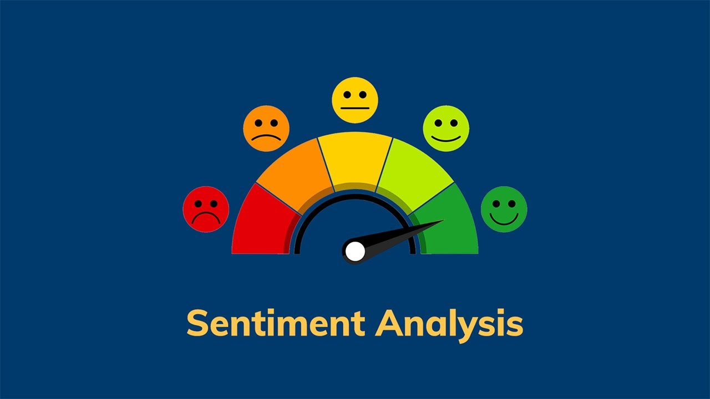

# Sentiment Analysis 

This is implementation for sentiment analysis project



## Requirements

- Python 3.8 or leter

### Install Python Using Miniconda

1) Download and install MiniConda from [here](https://docs.anaconda.com/miniconda/#quick-command-line-install)

2) Create a new environment using the following command:
```bash
$ conda create -n Sentiment_Analysis python=3.8
```

3) Activate the environment:
```bash 
$ conda activate Sentiment_Analysis
```

### (Optional) Setup you command line interface for better readability
```bash
export PS1="\[\033[01;32m\]\u@\h:\w\n\[\033[00m\]\$ "
```

## Installation

### Install the required packages
```bash
$ pip install -r requirements.txt
```

### Setup the environment variables
```bash
$ cp .env.example .env
```

Set your environment variables in the `.env` file. Like `OPENAI_API_KEY` value.


### Run the Flask server
```bash
$ gunicorn app:app --reload --host 0.0.0.0 --port 5000
```

## All Models with Files

| Model Name                      |   Model                            |
|---------------------------------|------------------------------------|
| Restaurant Reviews(naive bayes) |[Link](https://www.kaggle.com/models/tfmohamedyahia/sentiment-analysis-restaurant-reviewsnaive-bayes) |

